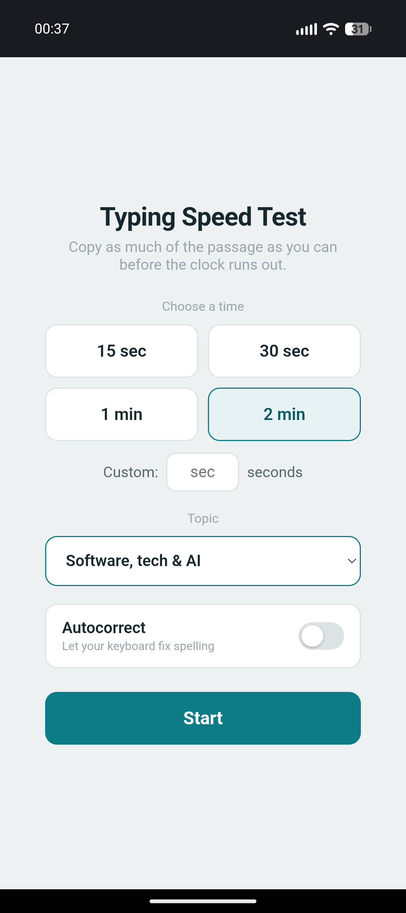
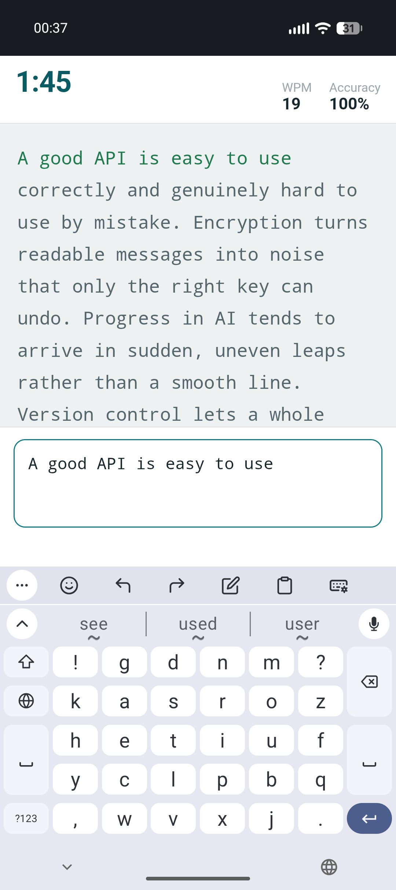
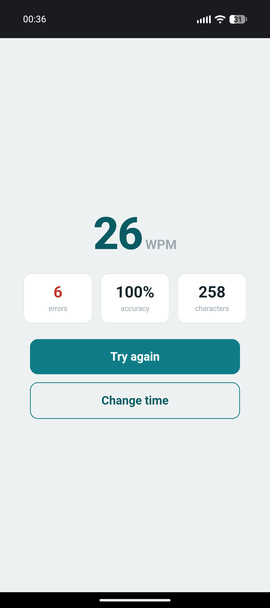

# Typing Practice

A small, mobile-friendly typing speed test. Pick a duration and a topic, then
copy as much of the passage as you can before the clock runs out. Passages are
assembled fresh from themed sentence pools each round, so they effectively never
repeat. There is also a **free typing** mode: skip the passage and type anything
you like for the time limit, and it just reports your speed at the end.

This project started life as a single HTML file and has been restructured into a
tested, modular codebase that is easy to extend -- especially with **new text
topics**.

## Screenshots

<p align="center">
  
  &nbsp;&nbsp;
  
  &nbsp;&nbsp;
  
</p>

<p align="center"><em>Setup &middot; a test in progress &middot; results</em></p>

From the **setup** screen you pick a time limit and a topic (and optionally let
your keyboard autocorrect). During a **test**, the clock counts down while your
live WPM and accuracy update and each character turns green as you type it
correctly. When time runs out -- or you finish the passage -- the **results**
screen shows your WPM alongside errors, accuracy, and total characters typed.

## Quick start

```bash
npm install      # install dependencies
npm run dev      # start the dev server (Vite) and open the printed URL
```

Other useful commands:

```bash
npm test         # run the unit tests once
npm run test:watch  # run tests in watch mode
npm run coverage # run tests with a coverage report
npm run lint     # lint with ESLint
npm run format   # auto-format with Prettier
npm run check    # lint + format check + tests (what CI runs)
npm run build    # produce a static production build in dist/
npm run preview  # preview the production build locally
```

The build in `dist/` is fully static and can be hosted anywhere (GitHub Pages,
Netlify, an S3 bucket, etc.).

## Download a prebuilt version

Every push to `main` builds the app and publishes it to a GitHub Release. The
latest build is always here:

- **[Download the latest build](https://github.com/sophiehicks1/typing-practice/releases/latest)**

Each release includes:

- `typing-practice.html` -- the **whole app in a single self-contained file** (all
  JS and CSS inlined). Download it and open it in any browser; double-click works,
  no server needed.
- `typing-practice.apk` -- an **installable Android app** (a thin WebView wrapper
  around the same file; runs offline, no permissions). Since it is not on the Play
  Store, sideload it: enable "install unknown apps" for your browser or file
  manager, then open the APK. It is debug-signed. See [`android/`](android/).
- `typing-practice-build.zip` -- the same web build as a zip.

You can also trigger a build manually from the **Actions** tab
(_Release build_ -> _Run workflow_). The build is attached both to the Release
and as a workflow artifact on the run.

> Note: a normal multi-file Vite build (separate `.js`/`.css`) will not run when
> opened directly via `file://` -- browsers block ES-module scripts from the
> local file origin. That is why the build is bundled into one file (see
> `vite.config.js`).

## What can I change, and where?

| I want to...                            | Go to                                   |
| --------------------------------------- | --------------------------------------- |
| Add a new topic or edit an existing one | `src/content/topics/*.json` (see below) |
| Change how passages are assembled       | `src/core/passage.js`                   |
| Change WPM / accuracy math              | `src/core/stats.js`                     |
| Change typing behavior / char states    | `src/core/engine.js`                    |
| Change the on-screen behavior / DOM     | `src/ui/`                               |
| Change styling                          | `src/styles.css`                        |

## Adding a new topic (the short version)

1. Create a new file `src/content/topics/<your-topic-id>.json`.
2. Give it an `id` (matching the file name), a `name`, a `description`, and a
   list of `sentences`.
3. Run `npm test`. The content tests will tell you if anything is off.

That is it -- topics are auto-discovered, so there is no list to update. The full
walkthrough, including all the content rules, lives in
[`docs/adding-topics.md`](docs/adding-topics.md).

## Project layout

```
src/
  content/
    topics/        one JSON file per topic (the content you will edit most)
    schema.js      the rules that define a valid topic
    loader.js      auto-discovers and validates all topics
  core/            pure, DOM-free logic (fully unit-tested)
    random.js      seedable randomness + shuffle
    stats.js       WPM / accuracy math
    time.js        countdown + clock formatting
    passage.js     assembles passages from topics
    engine.js      the typing session state machine
  ui/              the thin DOM layer
    passage-view.js  renders characters and their states
    app.js         wires the core to the page
  main.js          entry point
  styles.css       all styling
test/              one test file per module
docs/              architecture + contributor guides
android/           minimal Android WebView wrapper (builds the installable APK)
```

See [`docs/architecture.md`](docs/architecture.md) for how the pieces fit
together, and [`CONTRIBUTING.md`](CONTRIBUTING.md) for the contribution workflow.

## License

MIT -- see [`LICENSE`](LICENSE).
